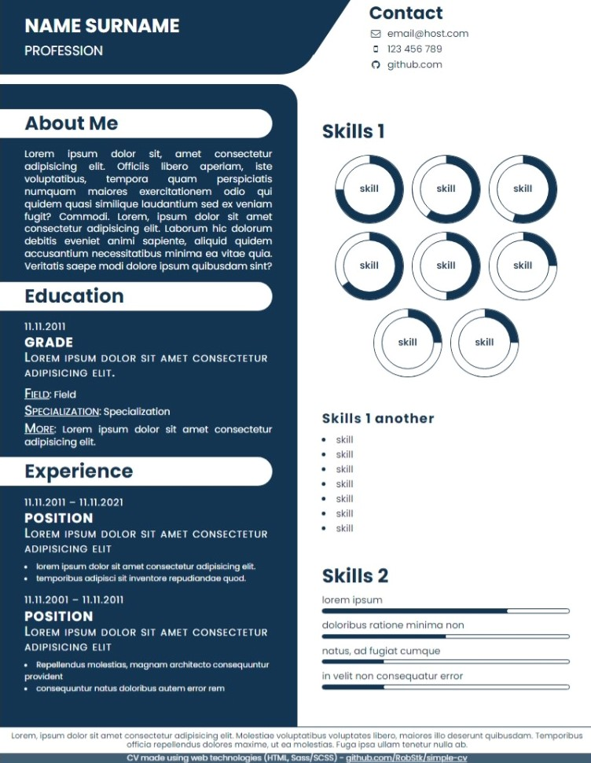

# Simple-CV

CV template for your own filling.  

## Table of contents

- [Overview](#overview)
  - [Assumptions](#assumptions)
  - [Screenshot](#screenshot)  
  - [Technologies](#technologies)
  - [Links](#links)
- [Author](#author)

## Overview

### Assumptions

- text content section
- skill pie charts
- skill bar charts

### Screenshot

### Technologies  

- HTML
- Sass/SCSS

### Links

- Project repository: https://github.com/RobStk/simple-cv

## Author

- Website: https://github.com/RobStk